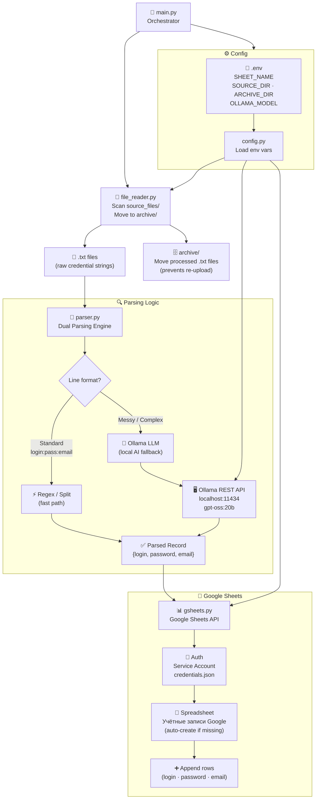

# 🗃️ Google Accounts Sorter

> Automatically parse, extract, and upload Google account credentials from raw text files into Google Sheets, using local LLMs (Ollama) to decipher messy or complex strings.


---

## 🏗️ Architecture



---

## ✨ Features

- **Dual Parsing Engine**: Fast split for standard `login:pass:email` lines, and AI fallback (Ollama) for messy strings with extra text.
- **Google Sheets Integration**: Automatically creates spreadsheets and appends rows cleanly.
- **Smart Archiving**: Successfully processed `.txt` files are moved to an `archive/` folder so you don't upload duplicates.
- **Secure Configuration**: Uses `.env` files instead of hardcoded variables.

---

## 🚀 Setup Instructions

### 1. Requirements

- Python 3.9+
- [Ollama](https://ollama.com/) installed and running locally (`ollama serve`).
- The `gpt-oss:20b` model (or any other model) pulled in Ollama: `ollama pull gpt-oss:20b`.

### 2. Google Cloud Setup (Service Account)

To let the script write to Google Sheets, you need a Service Account.

1. Go to the [Google Cloud Console](https://console.cloud.google.com/).
2. Create a new project or select an existing one.
3. Enable the **Google Sheets API** and **Google Drive API**.
4. Go to **APIs & Services** > **Credentials**.
5. Click **Create Credentials** -> **Service Account**.
6. After creating the account, go to its **Keys** tab, click **Add Key** -> **Create new key** -> **JSON**.
7. Download the JSON file, rename it to `credentials.json`, and place it in the root folder of this project.

### 3. Installation

```bash
git clone https://github.com/Totsamuychel/google-acc-sorter.git
cd google-acc-sorter

# Create a virtual environment
python -m venv venv
source venv/bin/activate  # On Windows use: venv\Scripts\activate

# Install dependencies
pip install -r requirements.txt

# Copy the env template
cp .env.example .env
```

### 4. How to use

1. Place your text files containing accounts inside the `source_files/` directory.
2. Run the script:
   ```bash
   python main.py
   ```
3. The script will:
   - Parse all `.txt` files in `source_files/`.
   - Send messy strings to Ollama.
   - Upload the extracted accounts to the Google Sheet named `Учётные записи Google`.
   - Move the parsed text files to the `archive/` directory.

---

## 📂 Project Structure

```
google-acc-sorter/
├── main.py                  ← Main orchestrator script
├── requirements.txt         ← Dependencies
├── .env.example             ← Environment variables template
├── sorter/                  ← Core modules
│   ├── config.py            ← Settings loaded from .env
│   ├── file_reader.py       ← Directory / archive management
│   ├── gsheets.py           ← Google Sheets API interactions
│   └── parser.py            ← Extraction logic (Regex + Ollama)
├── tests/
│   └── test_parser.py       ← Unit tests for the parser
└── sorter_legacy.py         ← Original monolithic script (for reference)
```

---

## 🛠️ Configuration

Edit your `.env` file to customize behavior:

| Variable | Default | Description |
|---|---|---|
| `CREDENTIALS_FILE` | `credentials.json` | Path to Google Service Account JSON |
| `SHEET_NAME` | `Учётные записи Google` | Target spreadsheet name |
| `SOURCE_DIR` | `source_files` | Folder to read `.txt` files from |
| `ARCHIVE_DIR` | `archive` | Folder to move processed files to |
| `OLLAMA_MODEL` | `gpt-oss:20b` | Ollama model to use for complex parsing |

---

## 💡 Improvement Roadmap

- [ ] **Async Processing**: Use `asyncio` for Ollama requests. Currently, complex lines are sent to Ollama one by one. Making these requests parallel would massively speed up processing of very messy files.
- [ ] **Custom Prompts via File**: Load the Ollama prompt from a `prompt.txt` file instead of defining it in the code, allowing users to tweak instructions without touching python code.
- [ ] **Deduplication**: Check Google Sheets for existing logins before appending to prevent duplicate entries if the same account is found in multiple files.
